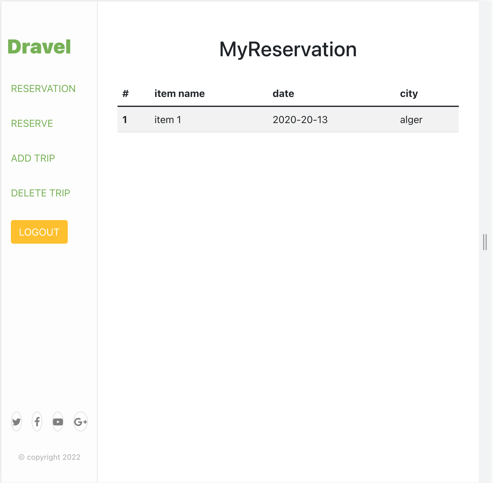
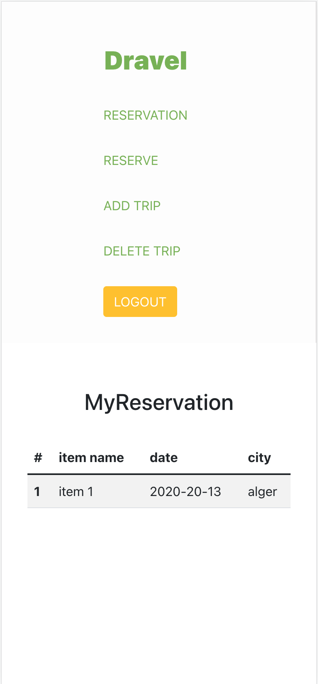

# DRAVEL APP

The project you are going to build for the Final Capstone Project is based on an app to book an appointment to try a motorcycle. You should follow the given design of the website, but you must personalize the content, i.e., instead of booking an appointment to try a motorcycle, you can build an app to book an appointment with a doctor, or reserve an online class with a teacher. This is highly encouraged since having unique projects in your portfolio will help you stand out while looking for jobs.

## Views

> | -   | Home Page                        | -   | Dashboard                          | -   | Reservation                           | -   |
> | --- | ---------------------------------- | --- | ----------------------------------- | --- | ----------------------------------- | --- |
> | -   |  | -   |  | -   |  | -   |

## Live App link
- Here is the [link](https://microverse.org) to the live app `https://dravel-app.herokuapp.com/`

## objectives
Apply technical knowledge and skills gained in previous modules in a complex project.
Understand pros and cons of different approaches of connecting Ruby on Rails back-end with React front-end.
Understand principles of Ruby on Rails and React frameworks.
Apply Ruby best practices and language style guides in code.
Apply RoR best practices and language style guides in code (e.g. thin controllers).
Apply JavaScript best practices and language style guides in code.
Apply React best practices and language style guides in code.
Learn about and practice giving constructive feedback to teammates.
Perform a code review for a team member.
Use the "Review change"" feature from GitHub.
Write clear, professional, and respectful review comments for other team members.
Explain "why" a change is requested when giving a code review.
Plan a 2+ week project with no interim Microverse-set milestones and submit it on time.
Apply knowledge of setting working agreements to set group project teams up for success.
Independently implement best practices for group agreements to improve teamwork in larger group project.
Demonstrate ability to apply best practices of communication for resolving teamwork challenges.
Understand that respect is the foundation of strong relationship-building with teammates.
Show up throughout group projects as a reliable and committed team member who communicates and manages your time effectively.
Recognize the importance of investing in good working relationships with teammates.
Understand principles of strong teamwork (being reliable, committed, and consistent) and how to apply them in group projects.
Recognize the value of making equal contributions to group projects to produce the best outcome.

## Built With

- React
- Test
- Bootstrap

## Getting Started

- Make sure you have node installed in your system.

Clone this repository by running `https://github.com/billionsjoel/dravel-app.git` in your command line.

Navigate to the repository by running `cd dravel`.

## Installation

- Clone the repo and run `npm install` in the command line to install the dependencies.
- run `npm start`

## Author

👤 **Atugonza Joel Billions**

- GitHub: [@billionsjoel](https://github.com/billionsjoel)
- LinkedIn: [Billionsjoel](https://www.linkedin.com/in/billionsjoel/)
👤 **Abdesalem**

- GitHub: [@billionsjoel](https://github.com/billionsjoel)
- LinkedIn: [Billionsjoel](https://www.linkedin.com/in/billionsjoel/)

👤 **Jos Kalenda**

- GitHub: [@billionsjoel](https://github.com/billionsjoel)
- LinkedIn: [Billionsjoel](https://www.linkedin.com/in/billionsjoel/)

👤 **Aneikan Udo**

- GitHub: [@billionsjoel](https://github.com/billionsjoel)
- LinkedIn: [Billionsjoel](https://www.linkedin.com/in/billionsjoel/)

## 🤝 Contributing

Contributions, issues, and feature requests are welcome!

Feel free to check the [issues page](https://github.com/billionsjoel/budgety/issues).

## Show your support

Give a ⭐️ if I like this project!

## Acknowledgments

- Original design idea by [Murat Korkmaz](https://www.behance.net/gallery/19759151/Snapscan-iOs-design-and-branding?tracking_source=) on Behance.
- Hat tip to Microverse
